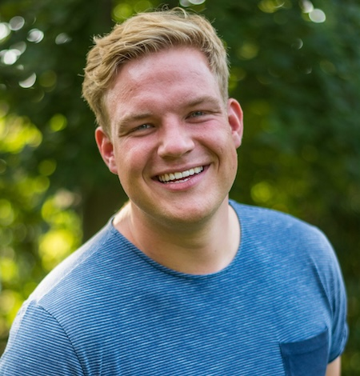
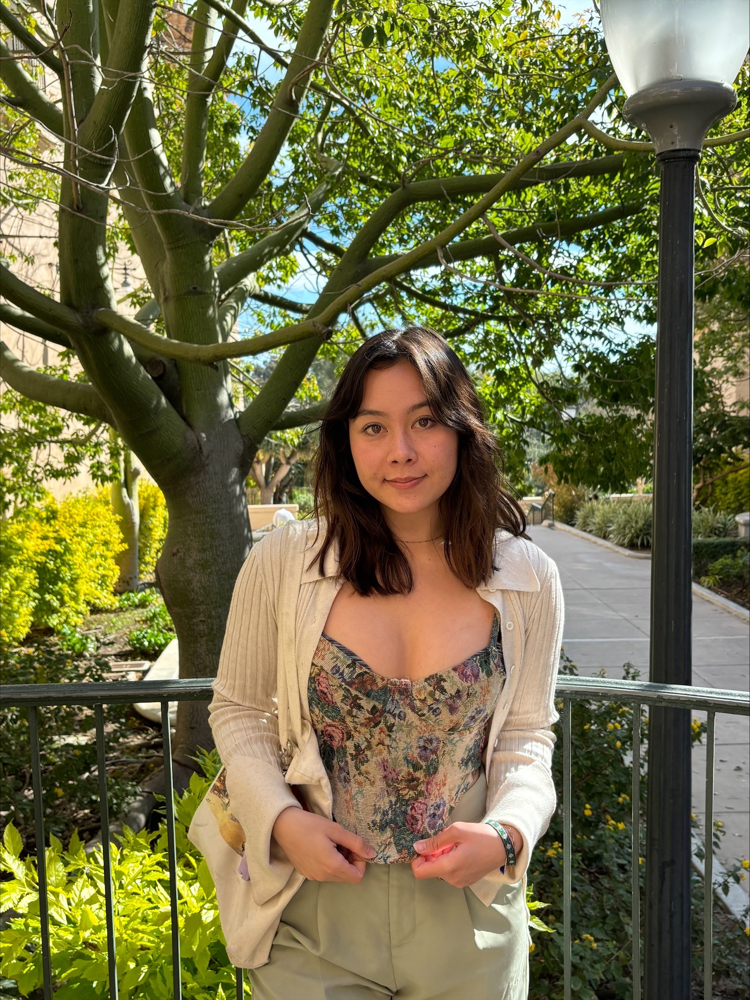
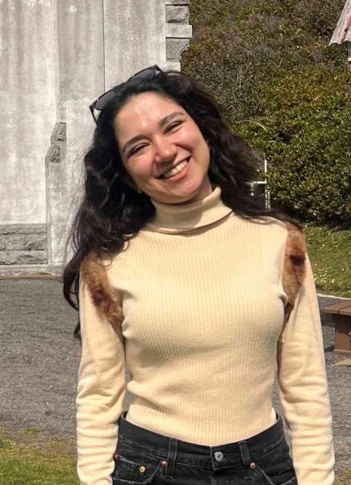
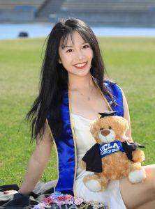

## Dominik Grätz

Dominik is a sixth-year PhD student in Ulrich Mayr's lab at the University of Oregon. He is interested in cognitive control, specifically in how the cognitive system selects information from different sources. He uses R primarily to clean, analyze, and visualize data, but also to create Shiny applications or to edit images.

## Assistants

### Sophia Angleton 

Sophia is a third-year PhD student working with Ulrich Mayr in the Cognitive Dynamics Lab. Her research interests include cognitive control- specifically cognitive stability/flexibility mechanisms, decision-making, working memory, and pre-crastination. She uses R to clean, analyze and visualize data and has taken the Educational Data Science Specialization course series offered here at the University of Oregon (if you have any questions about that!). Outside of research, she enjoys spending time with her two cats, biking, swimming, climbing, and searching (in vain) for half-decent food in Eugene.

### Fatemeh Ghazavi Khorasgani

Fatemeh is a second-year PhD student working with Kate Mills in the Worm Lab. Her research focuses on social-cognitive development and decision-making, with a particular interest in how children and adolescents understand and respond to climate change. She uses R to clean, analyze, and visualize longitudinal and experimental data.

### Ziyuan Chen

Ziyuan is a third-year PhD student in Deepu Murty’s Adaptive Memory Lab. She wonders how emotion interacts with human memory processes that adaptively shape our perception and behavior. Ziyuan loves playing music and badminton, cooking, spending time with her cat, and constantly seeking for novelty in life.

